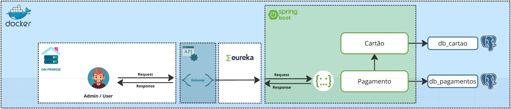

## Sistema de Pagamentos

### Visão Geral
Este projeto implementa um sistema de pagamentos robusto e escalável, utilizando uma arquitetura de microserviços baseada em Spring Boot. 
O sistema permite realizar diversas operações relacionadas a pagamentos, como realizar pagamento e consultar pagamentos por cliente.

### Arquitetura
O sistema é composto por diversos componentes que interagem entre si para oferecer as funcionalidades de pagamento:

* **Cliente:** Interface de usuário (Postman) responsável por interagir com o sistema.
* **API:** Camada de exposição dos serviços, responsável por receber e processar as requisições dos clientes.
* **Eureka Server:** Serviço de registro e descoberta de serviços, utilizado para localizar dinamicamente os serviços disponíveis na arquitetura.
* **Serviços de Negócio:**
  * **Pagamento:** Serviço responsável por processar as transações de pagamento.
  * **Consultar Pagamento Por Cliente:** Serviço responsável por consultar as transações de um cliente especifico.
* **Banco de Dados:** Armazena as informações sobre pagamentos.



### Fluxo de Trabalho
1. **Solicitação do Cliente:** O cliente envia uma requisição para a API, solicitando uma determinada operação (por exemplo, realizar um pagamento).
2. **Processamento da API:** A API recebe a requisição, valida os dados e encaminha a requisição para o serviço de pagamento (ou cartão) apropriado, utilizando o Eureka Server para localizar o serviço.
3. **Processamento do Serviço:** O serviço de pagamento (ou cartão) processa a requisição, acessando o banco de dados para realizar as operações necessárias (por exemplo, verificar se o cartão é válido, realizar a transação).
4. **Retorno da Resposta:** O serviço retorna uma resposta para a API, indicando o resultado da operação.
5. **Resposta ao Cliente:** A API retorna a resposta para o cliente.

### Tecnologias Utilizadas
* **Spring Boot:** Framework Java para desenvolvimento de aplicações web.
* **Spring Boot:** Gateway 
* **Eureka Server:** Serviço de descoberta de serviços.
* **PostgreSQL** Armazenamento dos dados do sistema.

### Pré-requisitos
* **Java** (21)
* **Maven**
* **Docker**

### Instalação
1. **Clone o repositório:**
   ```bash
   https://github.com/HACKATON-FIAP/arquitetura.git

## Estrutura do Projeto

A aplicação está organizada nos seguintes pacotes:
### `com.fiap.pagamentos`

#### `api`
- **controller**
  - `PagamentoController.java`: Controlador responsável por gerenciar as requisições relacionadas aos pagamentos.
- **handler**
  - `ApiExceptionHandler.java`: Classe responsável por tratar exceções lançadas pela aplicação e retornar respostas apropriadas.
- **model**
  - `PagamentoDTO.java`: Data Transfer Object (DTO) utilizado para transferir dados de pagamento entre as camadas da aplicação.
- **response**
  - **exception**
    - `BadRequestResponse.java`: Resposta para erros de requisição inválida (400).
    - `NotFoundResponse.java`: Resposta para recursos não encontrados (404).
  - **success**
    - `ConsultaPorChaveResponse.java`: Resposta de sucesso para consultas de pagamento por chave.

#### `config`
- **ModelMapperConfig.java**: Configuração do ModelMapper para mapeamento de objetos.
- **SwaggerConfig.java**: Configuração do Swagger para documentação da API.

#### `domain`
- **exception**
  - `InternalServerErrorException.java`: Exceção para erros internos do servidor (500).
  - `ServiceUnavailableException.java`: Exceção para serviços indisponíveis (503).
- **model**
  - `Pagamento.java`: Entidade que representa um pagamento no domínio da aplicação.
- **repository**
  - `PagamentoRepository.java`: Interface de repositório para operações de persistência de pagamentos.
- **service**
  - `PagamentoService.java`: Serviço que contém a lógica de negócios relacionada aos pagamentos.

## Funcionamento da Aplicação

### Controladores
Os controladores são responsáveis por receber as requisições HTTP, processá-las e retornar as respostas apropriadas. O `PagamentoController` gerencia todas as operações relacionadas aos pagamentos.

### Tratamento de Exceções
O `ApiExceptionHandler` captura exceções lançadas pela aplicação e retorna respostas padronizadas com os códigos de status HTTP apropriados.

### Modelos e DTOs
Os modelos representam as entidades do domínio da aplicação, enquanto os DTOs são utilizados para transferir dados entre as camadas da aplicação.

### Respostas
As respostas são organizadas em pacotes para diferenciar entre respostas de sucesso e respostas de erro, facilitando a manutenção e a clareza do código.

### Configurações
As configurações da aplicação, como o mapeamento de objetos e a documentação da API, são centralizadas no pacote `config`.

### Repositórios e Serviços
Os repositórios são responsáveis pelas operações de persistência, enquanto os serviços contêm a lógica de negócios da aplicação.

